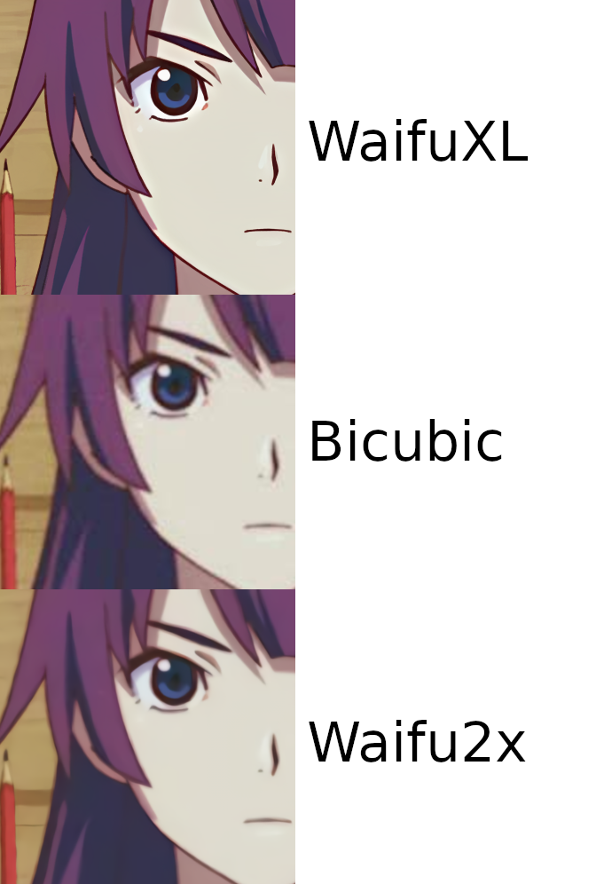
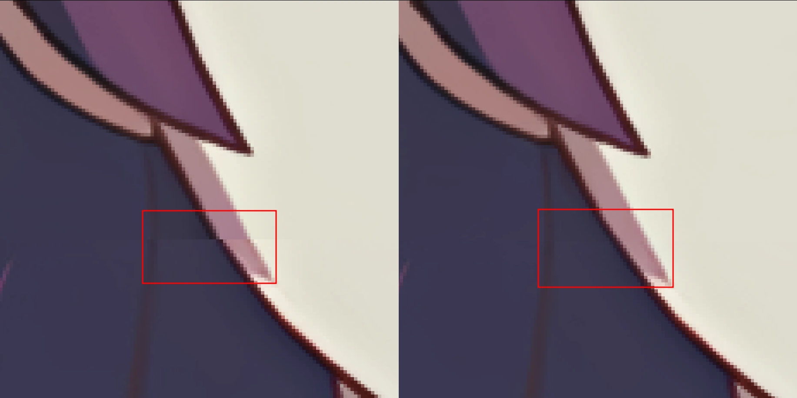

# We're Launching at [waifuxl.com](https://waifuxl.com/)!
Today we're finally launching our neural network powered super resolution website for anime-style drawings, [WaifuXL](https://waifuxl.com/)! This is a project that [The Future Gadgets Lab](https://github.com/TheFutureGadgetsLab/WaifuXL) has been working on for a while and we're really excited to share it with you.

WaifuXL is quite similar to [waifu2x](http://waifu2x.udp.jp/) in function, however, our super resolution model (the [Real-ESRGAN](https://arxiv.org/abs/2107.10833)) produces ***much*** better up-samples, we have a fun image property tagger, and our backend (or lack thereof) is radically different. When you use our service to upscale an image, rather than sending your input to a backend somewhere in the cloud to be up-sampled remotely, we send the up-sampling neural network (and the tagger) *to you* for execution directly on your laptop, desktop, phone, or tablet. We'll get to how this is possible in a moment, but first we're going to cover the models.



## The Networks
### Super Resolution
What sets the Real-ESRGAN apart from other models (and the models used by waifu2x) is not the architecture but it’s *training process*. The standard training process for super resolution networks is to simply take a high-resolution dataset of images, downscale them to a lower resolution, and train the network to map from the downscaled images to the original high-resolution ones. The Real-ESRGAN training process attempts to directly model the kind of degradations one might encounter in real-world low-quality images through a process they call a "high-order degradation model". During this process they combine many different degradations with various intensities to produce a visually corrupt input to the network. Here is an overview of the various degradations they apply, but refer to **Section 3** of the paper to get a better idea of the entire process:
 - Blur (multiple kinds)
 - Noise
 - Combinations of up-sampling and down-sampling with various algorithms
 - JPEG compression
 - Sinc filters (to model ringing and overshoot)

The training process is further improved by including a GAN loss (wherein a separate network learns to differentiate between the true high-res images and the super resolution network outputs, causing the two networks to compete) and a [Perceptual](https://arxiv.org/abs/1801.03924) loss.

### Image Tagging 
For our image tagger we're using a [MobileNetV3](https://arxiv.org/abs/1905.02244). The network will detect 2,000 different characteristics in the image, 2,000 different characters (mostly from anime or related media), and an explicitness rating (safe, questionable, or explicit). Here is an example of our tagger outputs:
 - Characteristics
   - Number of girls / boys in the image
   - Eye color
   - Hair color
   - Clothing types
 - Characters:
   - Naruto
   - Hatsune Miku
   - Megumin

### The Dataset
To train both of our models we are using the [Danbooru2021](https://www.gwern.net/Danbooru2021) dataset, comprised of ~4.9m images scraped from the Danbooru image board. Due to storage limitations we trained both models on a subset of ~1.2m images, however, this is likely a sizable enough subset to not have caused any problems. The tags in the Danbooru2021 dataset are quite diverse, with over 493,000 distinct tags, but they are *extremely* unbalanced. The most common tag is "1girl" which is present on millions of the images and by the time you get down to the 1,000th most common tag it is only found on ~10,000 images. The unbalanced nature of the tags certainly has resulted in a less than optimal tagger, but there is little that can be done about that.

## The Website

### The Not-Backend
Previously we mentioned that rather than running the models on a backend in the cloud, we're serving you the models for execution on your machine--how is this done? The [Onnx Runtime](https://onnxruntime.ai/) is an open source project aiming to accelerate machine learning training across a wide variety of frameworks, devices, and deployment targets--one of these targets being the web through a WebAssembly backend. After exporting the model to the `onnx` format we simply serve the model to you and their backend will take care of the rest. Best of all it supports SIMD acceleration and multithreading.

### The Upscaling Lifecycle
Generally, the lifecycle of WaifuXL can be described as taking in an input image, loading in the model, running the model on the image, and then creating an output image from the model results. There are more granular steps in this process that provide various tools and functionality, such as image chunking and GIF de/restructuring.  

In order to efficiently pass data between different services and UI components, all of the images are represented throughout the lifecycle as Data URIs. If you're not familiar, data URIs are a long string that basically provides a text encoding of a file, so they allow for you to store the image purely as a string. They begin with a small section describing the file format (`data:image/gif` or `data:image/png`), and then a long string that encodes the actual file contents.  

When the actual pixel information is displayed to a user on the site, these data URIs are simply passed into JSX image tags and displayed. When the various services need to actually gather information from the images (such as for chunking, or to build an ndarray to pass to the model) the data URIs are painted on an HTML canvas (this canvas is never shown to the user) and the `getImageData` function is called on the canvas context.  
The actual function we use to do this looks as follows:

```Javascript
function getPixelDataFromURI(inputURI) {
  return new Promise((resolve, reject) => {
    const img = new Image();
    img.src = inputURI;
    img.crossOrigin = "Anonymous";
    var results = null;
    img.onload = function () {
      const canvas = document.createElement("canvas");
      canvas.width = img.width;
      canvas.height = img.height;
      const context = canvas.getContext("2d");
      context.drawImage(img, 0, 0);
      resolve(context.getImageData(0, 0, img.width, img.height));
    };
  });
}
```

After we have all the pixel information in the image, we then convert this to an `ndarray`, using the `ndarray` and `ndarray-ops` libraries.
``` Javascript
export function buildNdarrayFromImage(imageData) {
  const { data, width, height } = imageData;
  const dataTensor = ndarray(new Uint8Array(data), [height, width, 4]);
  const dataProcessedTensor = ndarray(new Uint8Array(width * height * 3), [
    1,
    3,
    height,
    width,
  ]);
  ops.assign(
    dataProcessedTensor.pick(0, 0, null, null),
    dataTensor.pick(null, null, 0)
  );
  ops.assign(
    dataProcessedTensor.pick(0, 1, null, null),
    dataTensor.pick(null, null, 1)
  );
  ops.assign(
    dataProcessedTensor.pick(0, 2, null, null),
    dataTensor.pick(null, null, 2)
  );
  return dataProcessedTensor;
}
```
Finally, this `ndarray` is converted to a `Tensor` for the model input, as follows:
```Javascript
function prepareImage(imageArray) {
  const height = imageArray.shape[2];
  const width = imageArray.shape[3];
  const tensor = new ort.Tensor("uint8", imageArray.data, [
    1,
    3,
    height,
    width,
  ]);
  return { input: tensor };
}
```

The model then runs, using this new Tensor as input, and produces a new Tensor. This Tensor is converted to an ndarray, and we paint this ndarray to a canvas once again, and return the Data URI from this canvas.
```Javascript
export function buildImageFromND(nd, height, width) {
  const canvas = document.createElement("canvas");
  canvas.width = width;
  canvas.height = height;
  const context = canvas.getContext("2d");
  var data = context.createImageData(width, height);
  data.data.set(nd);
  context.putImageData(data, 0, 0);
  return canvas.toDataURL();
}
```
Finally, now that we have the output Data URI, we can render this output alongside the input to the user, using the react-compare-slider library to create a side-by-side view of the images. 

## Breakdown of Some "Fun" Problems

### Image Splitting
After some initial testing with upscaling large images, we realized that with a sufficiently large image, the upscaling model would fail. The cause of this turned out to be the 32-bit address space of WebAssembly, meaning our address space, and therefore our memory usage, is fundamentally limited. To get around this problem, we split large images into chunks and process the individual chunks instead of processing the entire image at once.

That would've been the end of the story if it weren't for the windowing artifacts. When image chunks are upscaled, there are visible artifacts along their boundaries in the combined image, shown below:



To get around this we allow chunks to *overlap* onto other chunks when they are upscaled, and then remove/merge the overlapping regions. We found that an overlap of only 4 pixels to each side was sufficient to remove the windowing effect.

### GIFs
GIFs work almost the exact same way that images do, except for on input they are split into each frame, each of these frames is upscaled individually, and then the frames are reassembled into a new GIF. This is basically just running the image upscaling process on each frame, and then combining these frames into a new GIF. This is accomplished with the help of [gif-js](https://github.com/jnordberg/gif.js), [gifuct-js](https://github.com/matt-way/gifuct-js), and [gif-extract-frames](https://github.com/transitive-bullshit/gif-extract-frames).  

The most challenging parts of this process was handling coalescing, since GIFs often only store information about pixels changed between frames rather than each frame of the GIF. Generally, `gif-extract-frames` is used to break the image down into individual frames, `gif.js` is used to create new GIFs, and `gifuct-js` primarily handles extracting the delay from GIFs.

### Safari Non-Compliance
One of the more interesting problems arose from a classic Web Development hurdle: non-compliant browsers. And of course, as Internet Explorer has been sunset, a new champion of non-compliance rises -- Apple's Safari browser. While significantly better than previously non-compliant browsers, Safari still offers various "fun" things it's decided not to implement. In this project, our main issues came from (what we believe) is Safari's SharedArrayBuffer implementation -- namely that it doesn't seem to work. The ONNX web runtime uses SharedArrayBuffers when running multi-threaded, so in Safari, trying to initialize the model to use more than one thread fails. At this time, we're getting around this by checking the User Agent of the browser, and if its a Webkit based browser / engine we fall back to serial execution. We've submitted an issue with ONNX to resolve this, and hopefully we will be able to give Webkit based browser users better speeds in the future.

As a sidenote, to enable SharedArrayBuffers in general you must set two response headers--Cross Origin Embedder Policy and Cross Origin Opener Policy. When you don't set these headers properly, there will be no issue thrown on any browser, as it is impossible for SharedArrayBuffers to be used at all. This led to plenty of confusion in local testing and early trials, as it became difficult to efficiently test changes and debug the issue locally. 

### Disagreement between PyTorch and ONNX
One operation used by the Real-ESRGAN is the Pixel UnShuffle, an operation where spatial width and height of an image (or Tensor) are traded for *depth* by squeezing some of the spatial information into the channel dimension. Both PyTorch and ONNX support this operation, however, they were performing this squeezing in different orders. This was resulting in an upscaled image that looks like the colors were inverted--not great. An issue was opened in PyTorch and in the meantime we implemented the operator from scratch. About a week ago the issue was finally resolved, and we were able to use the built in version.


# Wrap-up and Future Work for the Future Gadgets Lab
It was a bit all over the place and rushed, but we hope you enjoyed our write up on WaifuXL. This was our first big project as a group, so we were excited to share some details on our effort.

We hope you like [WaifuXL](https://waifuxl.com/), we're really happy with the quality of the model (of course, props to the researchers behind the Real-ESRGAN) and our method of delivery. Our model only performs well on anime-style drawings but we'd like to train a model on real images so we can provide high quality up-sampling for all types of images. We're also interested in adding some more models to the website, such as a style transfer model, but we're likely going to leave that to a later date.

Stay tuned for some more fun projects from us, we're always throwing around ideas and maybe we'll land on another one like this soon. Until then, keep expanding your Waifus.

